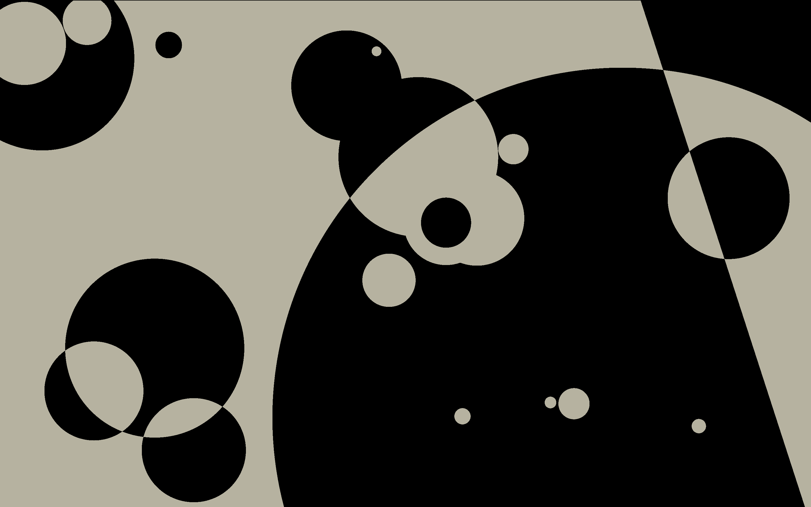
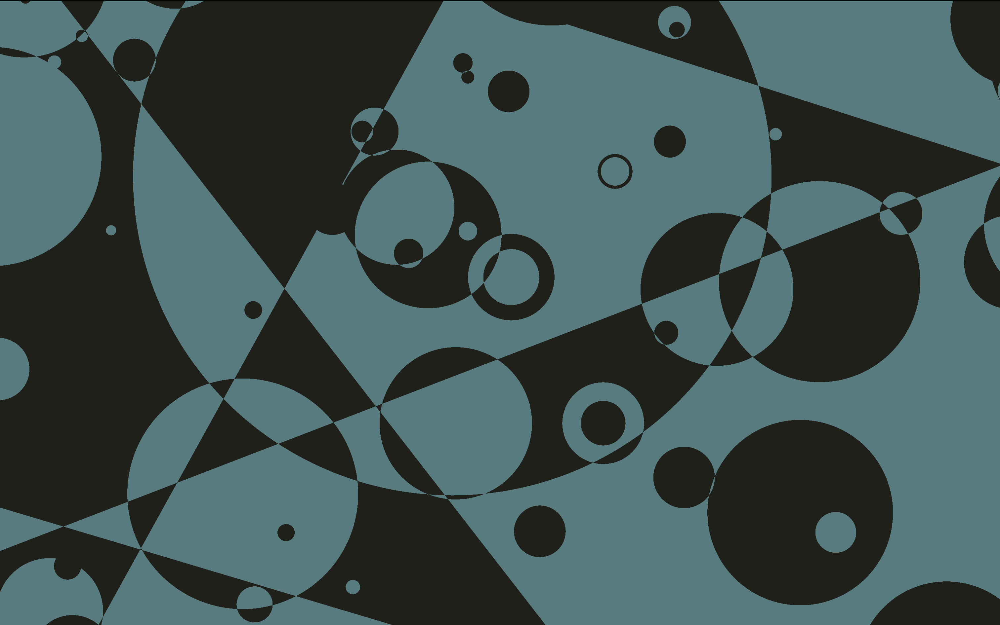
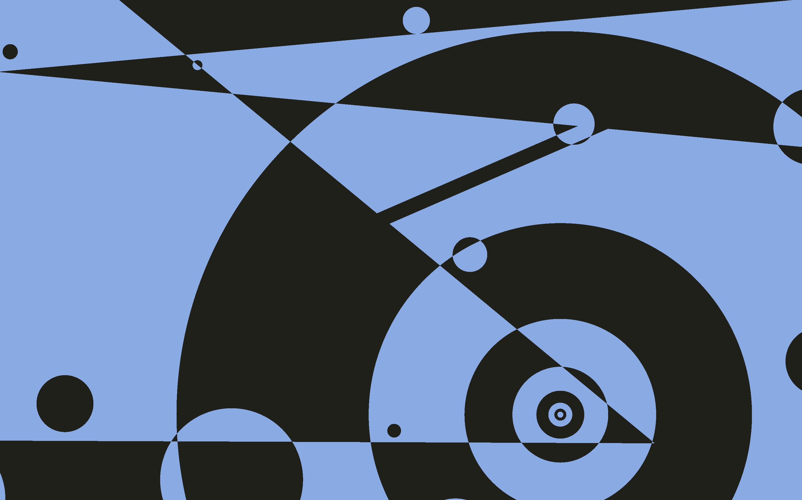
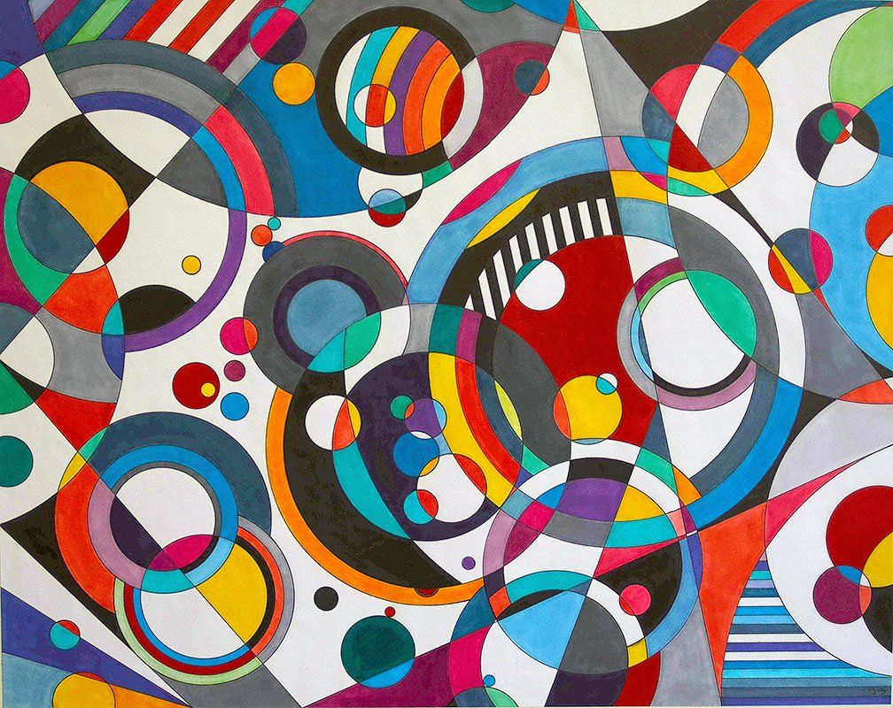

# [circles-and-lines](https://frowenz.github.io/circles-and-lines)

## Examples

  
  
   
  
  

## Inspiration

This project was inspired by [36 Points](https://www.sagejenson.com/36points) by Sage Jensen and by this piece, Eye Candy, by Bruce Gray:

    

